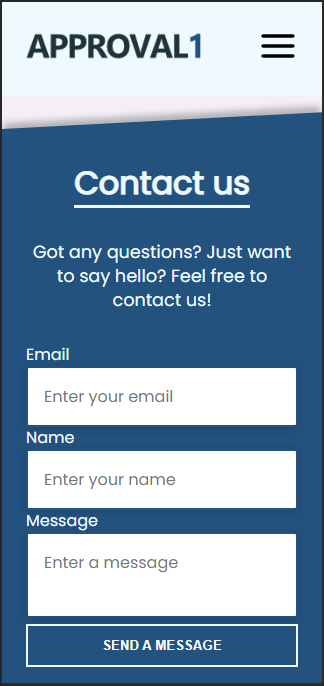

# APPROVAL1 Project - Final

## Introduction
We almost done with our project, just some finishing touches to make it resposive.

## Getting Started
You must have completed Lessons 1 and 2 before continuing.

### Objectives
- adding responsive style rules


### ⚠️ It is advised that you type the code yourself. By so doing, you will understand better.
---

#### **Making the webpage responsive**
1. Create a new file inside the `css` folder. Name it `responsive.css`
2. **css/responsive.css**: inside the empty file, type the code below for navbar and height
```
/* responsive navbar for small and medium devices */
@media screen and (max-width: 800px) {
  #navbar .navbar-inner {
    flex-wrap: wrap;
  }
  #navbar .navbar-inner .hamburger {
    padding: 1.5rem 0;
    display: block;
  }
  #navbar .navbar-inner .hamburger .feather {
    width: 2.5rem;
    height: 2.5rem;
  }
  #navbar .navbar-inner .links {
    display: none;
  }
  #navbar .navbar-inner .responsive {
    flex-basis: 100%;
    display: flex;
    order: 2;
    flex-direction: column;
    text-align: center;
  }
  .page .page-container {
    width: 100vw;
  }
  #inventory .inventory-inner .col-4 {
    grid-template-columns: repeat(2, 1fr);
  }
  #inventory .inventory-inner .col-4 .box {
    max-width: 50vw;
  }
  #inventory .inventory-inner .col-4 .box .description {
    grid-template-rows: fit-content(4rem) 8.75rem 1fr;
    align-items: center;
  }
}

/* responsive height */
@media screen and (min-height: 868px) {
  #hero {
    height: 50vh;
  }
  #contact {
    height: 45vh;
  }
  .page .page-container {
    height: 50vh;
    width: 70vw;
  }
}
```
3. **css/responsive.css**: add the code below for responsive width
```
/* desktops */
@media screen and (max-width: 1080px) {
  #inventory .inventory-inner .col-4 {
    grid-template-columns: repeat(2, 1fr);
  }
  #inventory .inventory-inner .col-4 .box {
    max-width: 50vw;
  }
  #inventory .inventory-inner .col-4 .box .description {
    grid-template-rows: fit-content(4rem) 6.25rem 1fr;
    align-items: center;
  }
}

/* large tablets and small laptops => 701 pixels up to 850 pixels */
@media screen and (max-width: 850px) {
  #contact {
    height: auto;
  }
  #contact .contact-inner .col-2 {
    grid-template-columns: 1fr;
  }
  #contact .contact-inner .col-2 .col-left form {
    grid-template-areas:
      "email"
      "name"
      "message";
  }
  #contact .contact-inner .col-2 .col-right {
    align-items: center;
  }
}

/* tablets and mobile devices => 700 pixels width and below */
@media screen and (max-width: 700px) {
  #hero {
    height: auto;
  }
  #hero .hero-inner {
    padding-top: 3rem;
    grid-template-columns: 1fr;
  }
  #hero .hero-inner .car {
    padding: 2rem 0;
  }
  #about .about-inner .about-grid {
    grid-template-columns: 1fr;
  }
  #about .about-inner .about-grid .about-left {
    padding-right: 0rem;
  }
  #inventory .inventory-inner .col-4 {
    grid-template-columns: 1fr;
  }
  #inventory .inventory-inner .col-4 .box {
    max-width: 100vw;
  }
  #inventory .inventory-inner .col-4 .box .description {
    grid-template-rows: fit-content(4rem) 1.5fr 1fr;
  }
}
```
4. **index.html**: add this after line 18
```
<link rel="stylesheet" href="css/responsive.css" />
```
5. The webpage should look like the preview below on small devices

 

## Conclusions
Congratulations our webpage is ready! Give yourself a pat on the back.

### Your mentor will guide you to host this project on GitHub.